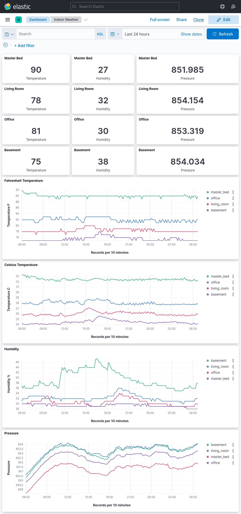

# Indoor Weather Server

This repository supports the Raspberry Pi SenseHat Indoor Weather application

## Overview
This is a simple application designed to collect weather data from _n_ number of nodes. The data will be persisted to Elasticsearch and utilize Kibana to visualize the data. This is meant partially as a tool to understand the fluxuations of temperature and humidity throughout an indoor environment, but also as a way to experiment with Kibana and other technologies requiring a dataset.

# Documentation
For more detailed information please seek the project documentation listed below.
- [Project Docs](https://docs.entropyinjection.com/books/indoor-weather)
- [Installation](https://docs.entropyinjection.com/books/indoor-weather/chapter/installation)
- [Engineering & Development](https://docs.entropyinjection.com/books/indoor-weather/chapter/engineering)

# Screens
