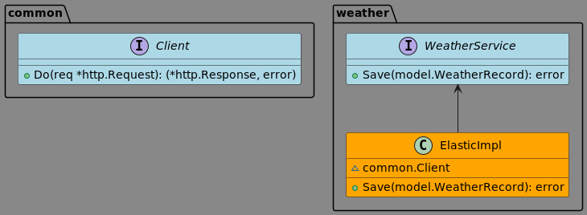
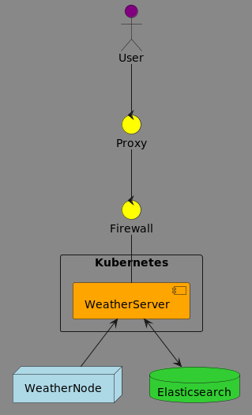

# Indoor Weather Server

This repository supports the Raspberry Pi SenseHat Indoor Weather application

## Overview
This is a simple application designed to collect weather data from _n_ number of nodes. The data will be persisted to Elasticsearch and utilize Kibana to visualize the data. This is meant partially as a tool to understand the fluxuations of temperature and humidity throughout an indoor environment, but also as a way to experiment with Kibana and other technologies requiring a dataset.

# Setup

## Configuration
You will need to following environment variables:
- **_ELASTIC_HOST_** - full hostname/port for the Elasticsearch host (ex: `http://elastic:9200`)
## Installation
Just clone the repository
## Run via CLI
```
make && bin/weather-server
```

## Run as Service
TBD...

# Development
## Architecture


## Deployment


## Logic
### Node/Server Flow


### User Flow
